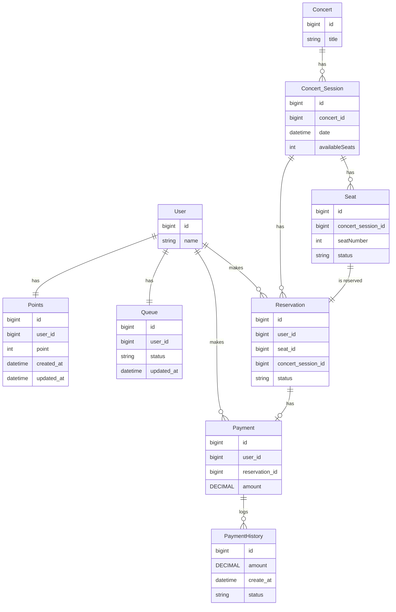

```mermaid
erDiagram
    User {
        bigint id
        string name
    }

    Points {
        bigint id
        bigint user_id
        int point
        datetime created_at
        datetime updated_at
    }

    Queue {
        bigint id
        bigint user_id
        string status
        datetime updated_at
    }

    Payment {
        bigint id
        bigint user_id
        bigint reservation_id
        DECIMAL amount
    }

    PaymentHistory{
        bigint id
        DECIMAL amount
        datetime create_at
        string status        
    }

    Concert {
      bigint id
      string title
    }

    Concert_Session {
      bigint id
      bigint concert_id   
      datetime date
      int availableSeats
    }

    Seat {
        bigint id
        bigint concert_session_id   
        int seatNumber
        string status
    }

    Reservation{
        bigint id
        bigint user_id 
        bigint seat_id
        bigint concert_session_id   
        string status
    }


%% 유저와 포인트는 1:1 관계
User ||--|| Points : "has"

%% 유저와 큐는 1:1 관계
User ||--|| Queue : "has"

%% 유저와 페이먼트는 1:N 관계
User ||--o{ Payment : "makes"

%% 유저와 페이먼트는 1:N 관계
User ||--o{ Reservation : "makes"

%% 콘서트와 콘서트 세션은 1:N 관계
Concert ||--o{ Concert_Session : "has"

%% 콘서트 세션과 좌석은 1:N 관계
Concert_Session ||--o{ Seat : "has"

%% 콘서트 세션과 예약은 1:N 관계
Concert_Session ||--o{ Reservation : "has"

%% 좌석과 예약은 1:1 관계
Seat ||--|| Reservation : "is reserved"

%% 페이먼트와 페이먼트 히스토리는 1:N 관계
Payment ||--o{ PaymentHistory : "logs"

%% 페이먼트와 페이먼트 히스토리는 1:N 관계
Reservation ||--o| Payment : has
```