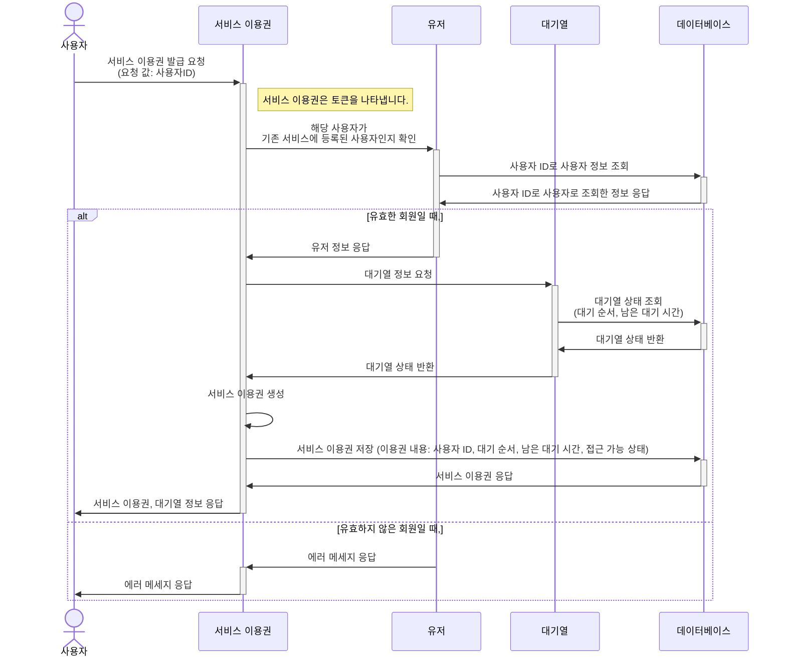
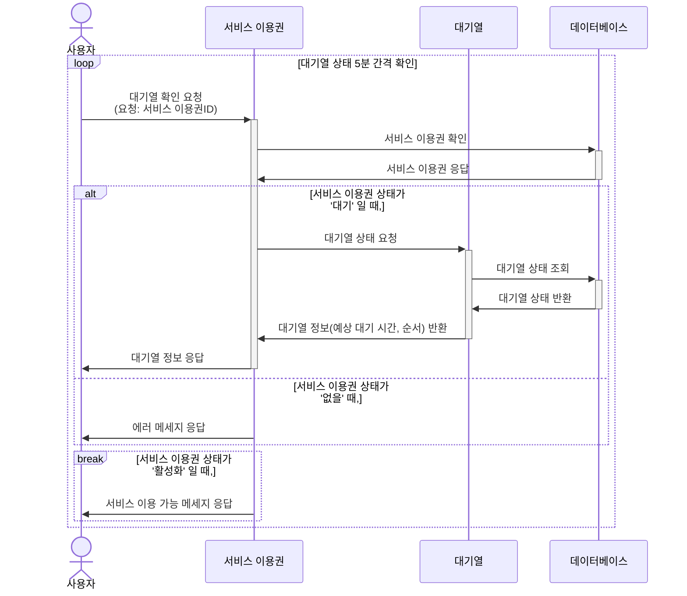
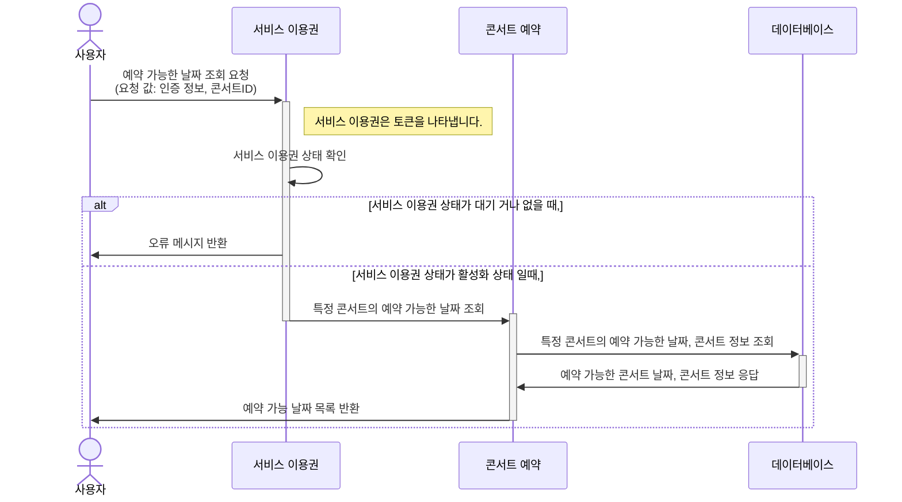
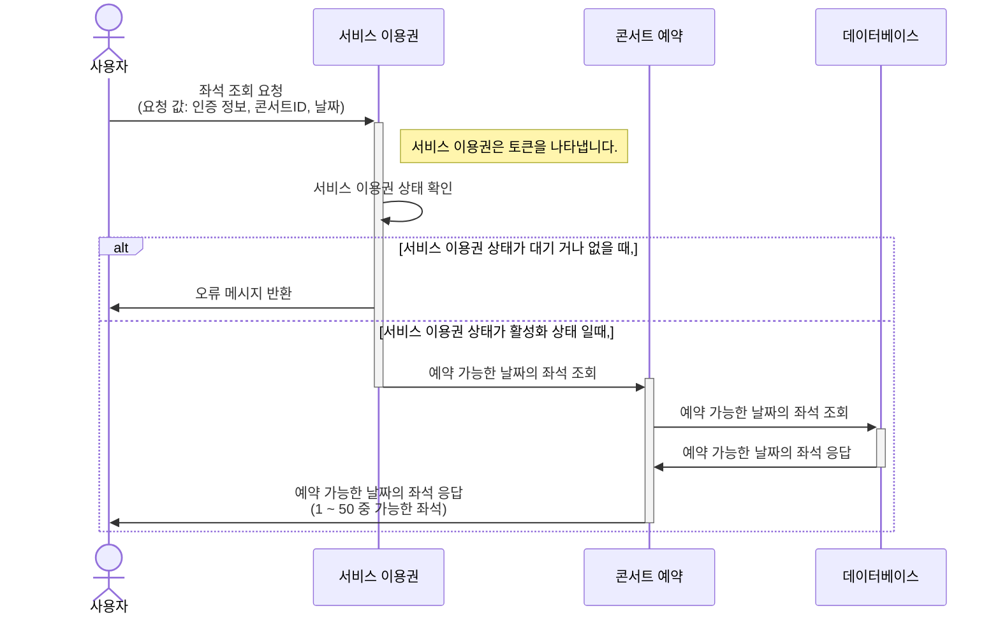
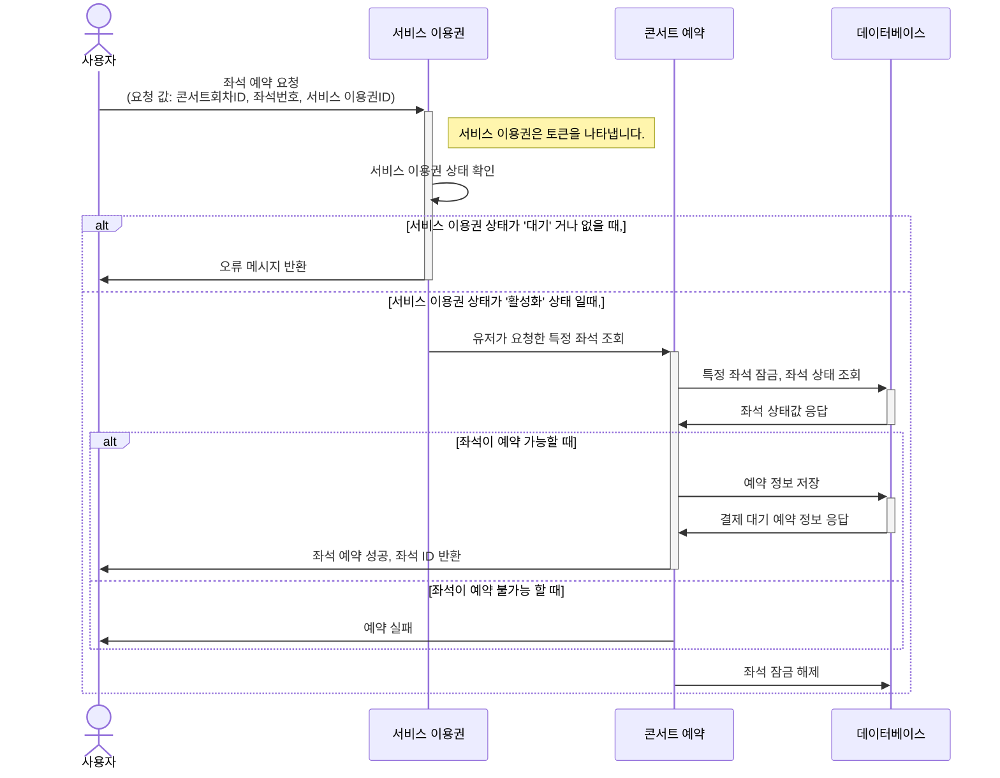
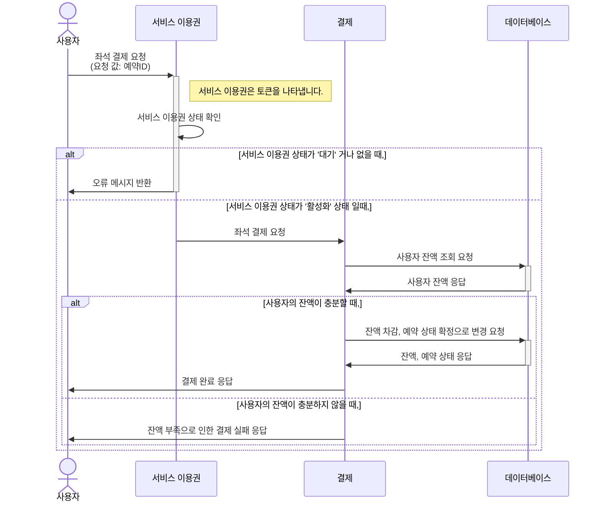
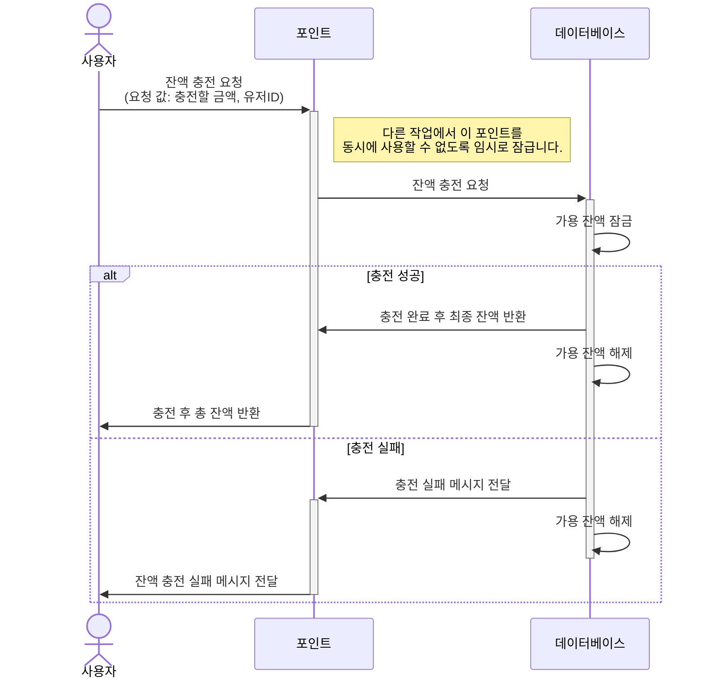
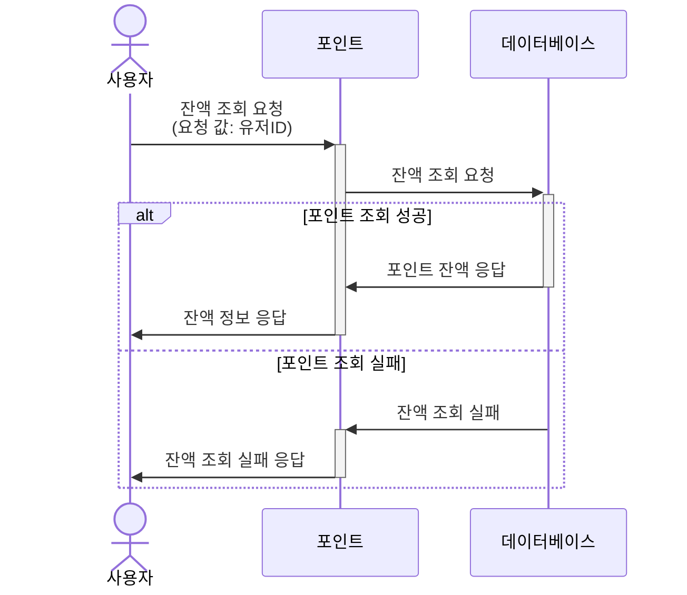
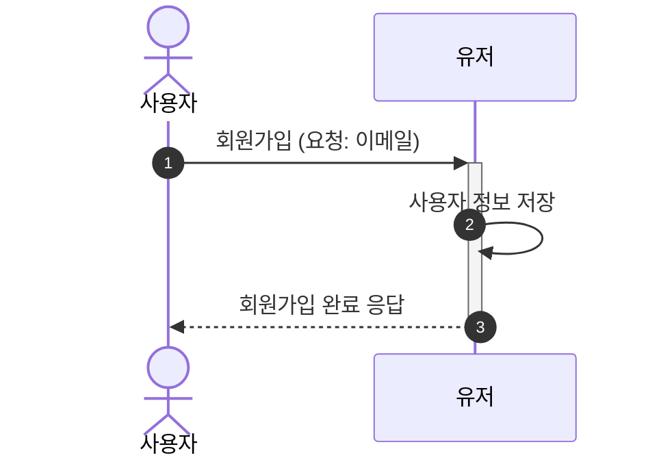

# 콘서트 예약 시퀀스 다이어그램 작성 보고서

## 1. 용어 정리

### 1.1 콘서트

- **콘서트**는 특정 기간 동안 여러 날짜에 걸쳐 진행될 수 있는 공연을 의미합니다. 하나의 콘서트는 **여러 개의 날짜**를 가질 수 있으며, **매 콘서트마다 여러 회차**로 나뉠 수 있습니다.

### 1.2 서비스 이용권 (Service Token)

- **서비스 이용권**은 사용자가 특정 서비스를 이용할 수 있는 권한을 나타냅니다. 일반적으로 "토큰"이라는 용어로 표현되며, 서비스 접근에 필요한 **사용자 정보**와 **상태 정보**가 포함됩니다. 주요 속성은 다음과 같습니다:
    - **사용자 ID**: 특정 사용자를 식별하기 위한 고유한 ID입니다.
    - **상태**: 서비스 이용 가능 여부를 나타내는 정보로, "대기", "활성화", 또는 "없음" 등의 상태를 가질 수 있습니다.

### 1.3 대기열 (Queue)

- **대기열**은 사용자가 서비스를 이용하기 위해 대기하는 상태를 관리하는 시스템입니다. 사용자가 많은 경우, 서비스를 순차적으로 이용할 수 있도록 **대기 순서**를 부여하고, **예상 대기 시간**을 제공하여 서비스 이용 준비 상태를 안내합니다. 대기열 시스템의 주요 요소는 다음과 같습니다:
    - **대기 순서**: 사용자가 몇 번째로 서비스를 사용할 수 있는지를 나타냅니다.
    - **예상 대기 시간**: 사용자가 대기 상태에서 남은 시간을 추정하여 보여줍니다.
    - **상태 변화**: 대기열에서 사용자의 상태가 변할 때, 예를 들어 순서가 앞당겨지거나 서비스 이용이 가능해지면 상태가 업데이트됩니다.

## 2. Use Case 중심 설계

시퀀스 다이어그램을 **Use Case(UC) 중심**으로 작성한 이유는 시스템이 사용자의 요구를 중심으로 어떻게 동작하는지를 명확히 보여주기 위함입니다. UC 중심 다이어그램은 사용자가 시스템과 어떻게 상호작용하는지 직관적으로 파악할 수 있도록 하며, 시스템이 요구사항에 따라 어떤 방식으로 처리되는지 시각적으로 표현합니다. 이러한 접근법은 개발 및 이해를 용이하게 하며, 요구사항 충족 여부를 쉽게 확인할 수 있도록 합니다.

### 주요 유스 케이스

### 대기열 관련

1. **유저 대기열 신청**: 사용자가 서비스를 이용하기 위해 대기열에 등록합니다.
2. **유저 대기열 확인**: 사용자가 본인의 대기 상태를 확인합니다.

### 콘서트 관련

1. **예약 가능 날짜 조회**: 콘서트의 예약 가능한 날짜 목록을 조회합니다.
2. **예약 가능 날짜의 좌석 조회**: 선택한 날짜에 예약 가능한 좌석 목록을 조회합니다.
3. **콘서트 좌석 요청**: 사용자가 원하는 날짜와 좌석을 선택하여 예약 요청을 합니다.
4. **콘서트 좌석 결제**: 예약한 좌석에 대한 결제를 진행합니다.

### 유저 관련

1. **잔액 충전**: 서비스 이용에 필요한 잔액을 충전합니다.
2. **잔액 조회**: 현재 사용 가능한 잔액을 조회합니다.
3. **회원 가입**: 서비스를 이용하기 위해 회원으로 등록합니다

## 3. 시퀀스 다이어그램

### 유저 대기열 신청

### 유저 대기열 확인

### 예약 가능 날짜 조회

### 예약 가능 날짜의 좌석 조회

### 콘서트 좌석 예약

### 콘서트 좌석 결제

### 잔액 충전

### 잔액 조회

### 회원가입

